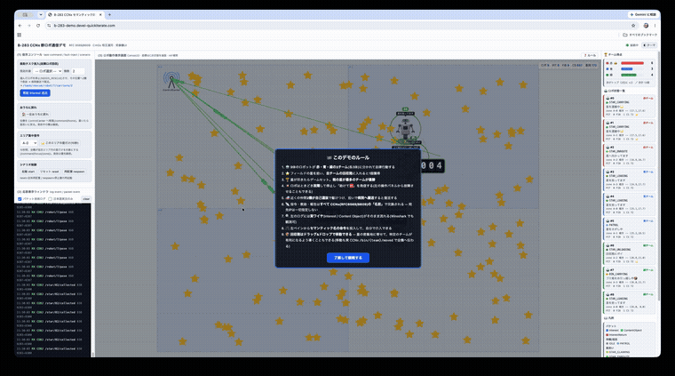
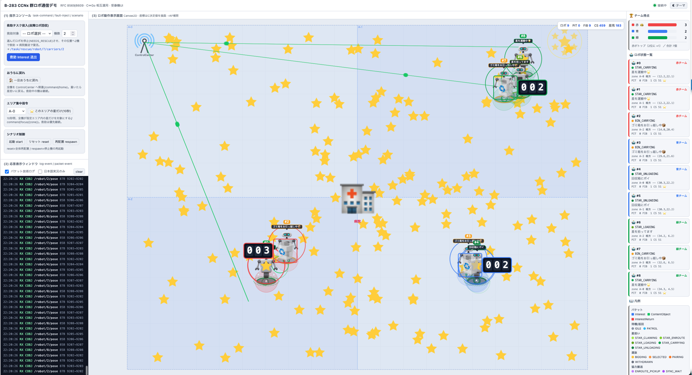
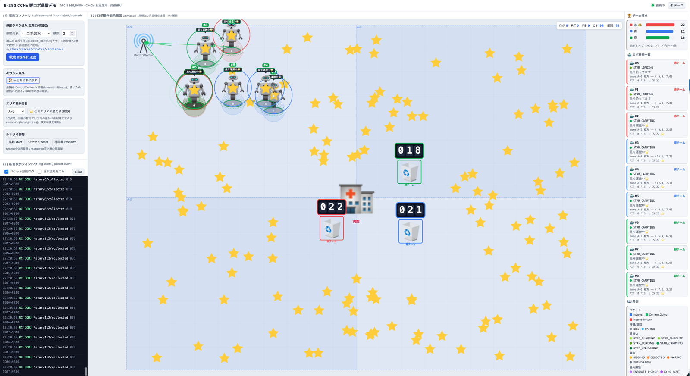
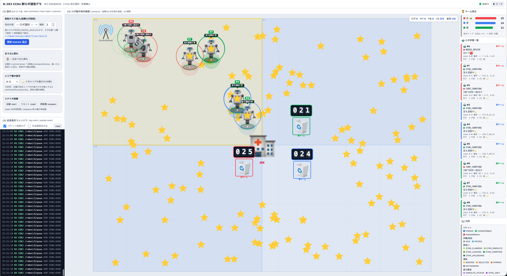
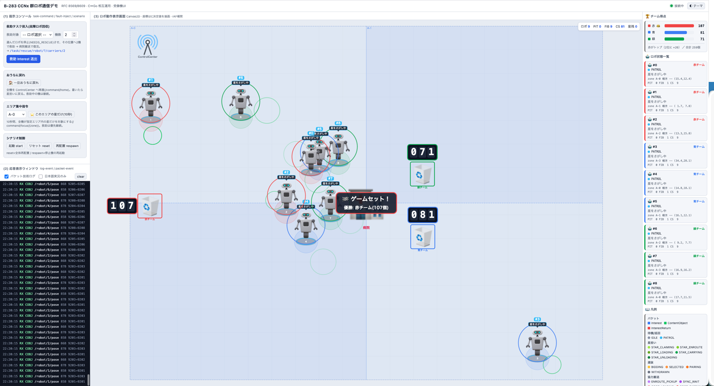

# B-283 CCNx セマンティック群ロボ通信デモ

自作の CCNx(RFC 8569 Semantics / RFC 8609 TLV)実装が **実際に分散動作**し、
**独立2実装(C / Go)がワイヤ単位でバイト一致して相互運用する**ことを、演出ではなく
物証で示すデモ。第三者が Wireshark と公開コードと機械判定で自ら再現できることを狙う。

正本(契約)は `docs/` の4文書。実装・ビルドはこれに厳密に従う。曖昧が生じたら
**DESIGN.md → WIRE.md → PROTOCOL.md → INTEROP.md** の順を正とする。

- `docs/DESIGN.md` — アーキ確定書(層分離・プロセス構成・ディレクトリ・生成物)
- `docs/WIRE.md`   — 8609 オクテット厳密仕様 + テストベクタ(単一の真実)
- `docs/PROTOCOL.md` — 名前空間 / 状態JSON / WebSocket / C↔Go IPC
- `docs/INTEROP.md` — C↔Go バイト一致・相互 decode の試験手順と合否

---

## 層分離(最重要 — A層と B層を混ぜない)

| 層 | 責務 | ドメイン依存 | C の実体 | Go の実体 |
|----|------|:---:|----------|-----------|
| **A層** | 8609 コーデック / フォワーダ(PIT・FIB・CS, Interest 集約, HopLimit, Interest Return, CO マッチング, キャッシュ)/ フェイス(UDP)/ Portal API | 無 | `client/libccnx.a` | `server/ccnx`(package ccnx) |
| **B層** | 挙動(A層 API を呼ぶだけ。ワイヤ形式を知らない) | 有 | `client/robot.c` → `swarm_robot` | `server/controller.go` / `observer.go` |

A層は「ロボも救助も星も知らない」純プロトコルスタック。各ロボは
**フォワーダ内蔵の自律 CCNx ノード**(libccnx が PIT/FIB/CS を持つフォワーダまで内包し、
 robot.c がその上のアプリ)。※実装範囲は RFC 8569/8609 の**限定サブセット**であり、
 「完全準拠」ではない(未実装機能は WIRE.md §意図的省略、逸脱は DESIGN.md §9 を参照)。

**A層の正しさの証明 = C版 `libccnx.a` と Go版 `package ccnx` が同一メッセージで完全バイト一致すること。**
両者は `WIRE.md` の1文書だけを介し、互いのコードを一切共有しない。一致すれば
「自作 CCNx が RFC に忠実」の実装非依存な物証になる(→ 相互運用テスト)。

---

## なぜ C と Go の2実装か(ブレさせない根拠)

- **C = 中核の CCNx 実装**。RFC8569/8609 を仕様書から自装したことを示す実証本体。
- **Go = デモ操縦席かつ第2実装**。Web UI / スーパーバイザ / 救助コントローラ / ワイヤ観測を担い、
  同時に `package ccnx` として 8609 を**独立に**実装する。
- **両 A層のワイヤ互換(バイト一致)= RFC 忠実の証明**。第2実装は「別作者・別言語が
  同じ公開仕様だけからバイト単位で一致した」ことを示すために存在する。

---

## ディレクトリ

```
B-283-ccnx-swarm/
├── docs/           契約4文書 + interop_check.sh(interop/run.sh への別名)
├── client/         C: 中核 CCNx 実装(A層 libccnx + B層 robot)
│   ├── ccnx.h codec.h            A層 公開ヘッダ(確定)
│   ├── codec.c ccnx_tables.c transport.c ccnx.c   A層 → libccnx.a
│   ├── robot.c                   B層 → swarm_robot
│   ├── ccnx_test.c               WIRE ベクタ自己証明 → codec_test
│   └── Makefile                  ルート Makefile への薄い転送
├── server/         Go: 操縦席 + 第2実装
│   ├── ccnx/       package ccnx(A層。C と同一ワイヤ)+ codec_test.go
│   ├── ccnx/cmd/ccnxcli   相互運用試験用の薄い CLI
│   ├── main.go supervisor.go hub.go controller.go observer.go
│   └── static/index.html         単一ページ UI(Canvas2D + 3ペイン, embed 配信)
├── interop/run.sh  C↔Go 相互運用ハーネス(INTEROP.md 命題 A〜D)
├── Makefile        C 側ビルドの実体(libccnx.a / swarm_robot / codec_test)
├── run.sh          make → go build swarmd → 起動 → URL 表示
└── README.md
```

> ビルド生成物は全て `client/` 直下(`libccnx.a` / `swarm_robot` / `codec_test`)と
> `server/`(`swarmd` / `ccnxcli`)に出る(DESIGN §5)。`.gitignore` 済み。

---

## 前提

- C コンパイラ(`cc`/`clang`/`gcc`)、`make`、`ar`
- Go(`server/` 配下。module 名 `swarmd`、A層は `import "swarmd/ccnx"`)
- 観測用に Wireshark(任意)

---

## ビルドと実行

### 1) まとめて起動(デモ)
```sh
./run.sh            # make → go build swarmd → swarmd 起動 → http://localhost:8080
./run.sh --check    # 起動前に相互運用 A〜D を実行し、全緑でなければ中止
./run.sh --build-only
```
起動後ブラウザで **http://localhost:8080** を開く。swarmd が Cロボ群を `os/exec` で立ち上げる。
Wireshark は **`lo0 udp portrange 9200-9300`** に張ると純 8609 だけが観測できる。

### 2) 個別ターゲット(ルート Makefile)
```sh
make            # = make all : libccnx.a + swarm_robot + codec_test
make lib        # client/libccnx.a のみ
make robot      # client/swarm_robot
make test       # codec_test をビルドして selftest 実行(WIRE ベクタ + round-trip)
make server     # server/swarmd をビルド
make interop    # 相互運用ハーネス(interop/run.sh)
make clean
make help
```
契約 DESIGN §5 手順1 の `cd client && make` も動く(`client/Makefile` がルートへ転送)。

### 3) 相互運用テスト(独立2実装のワイヤ一致 = RFC 忠実の物証)
```sh
bash interop/run.sh          # または  bash docs/interop_check.sh  /  make interop
```

---

## 相互運用テストの意義(このデモの核心)

`interop/run.sh` は `INTEROP.md` の合否表 A〜D を機械判定する。判定の唯一の接点は
既存の薄い CLI(C: `codec_test`、Go: `ccnxcli`)で、ハーネスはそれを orchestrate するだけ
(証明を第3の実装で薄めない)。

| # | 試験 | 合格条件 |
|---|------|----------|
| A | `vectors` diff | C-encode == Go-encode の差分0、かつ WIRE §6 の期待16進(golden)に一致 |
| B1 | C→Go decode(3ベクタ) | kind / uri / payload が原本と一致 |
| B2 | Go→C decode(3ベクタ) | 同上 |
| C1 | C `codec_test selftest` | exit 0 / `PASS`(内蔵ベクタ + ランダム round-trip) |
| C2 | Go `go test ./ccnx` | exit 0 / `ok` |
| D | 交差 round-trip(N件) | 相手が decode→再 encode してバイト一致 |

全緑 = 「C と Go が互いのコードを共有せず、`WIRE.md`=RFC8609 という公開仕様のみを介して
バイト単位で一致」= 自作 CCNx が RFC に忠実であることの、実装非依存で再現可能な証明。

さらに **動くデモそのものが相互運用の連続実演** になっている:
Go controller が `package ccnx` で encode した救助 Interest を Cロボが `libccnx` で decode し、
Cロボが `libccnx` で encode した Interest/CO を tap :9300 経由で Go observer が `package ccnx` で
decode する。バイト一致でなければ decode は失敗するので、**動くこと自体が動的な物証**である
(静的な物証 = 上表 A〜D、二重の証明)。

---

## デモ操作(ブラウザ 3ペイン / PROTOCOL §3)

1. **指示コンソール** — 救助タスク投入(zone / carriers、自然文可)、故障注入(ロボ選択)、
   シナリオ制御(start / reset / respawn)。
2. **応答表示ウィンドウ** — 系の実況を時系列テキスト(`log-event`: Interest 送出 / 引受 / 辞退 /
   ペア成立 / N機確定 / 故障検知 / 補充)。
3. **ロボ動作表示画面(Canvas2D)** — 状態色分けロボ、ゾーン A-*、病院、星、回収箱、
   線を走るパケット(`packet-event`)、PIT/FIB/CS ライブ。座標は **C が決めた値**を描画
   (ブラウザは位置を発明しない)。外部 CDN 依存なし(CSS/JS インライン)。

代表シナリオ: 各機星拾い(自律 claim を announce し傍受で二重取り回避)→「A-2 で病人発生、
2機で協力搬送」→ 距離連動バックオフで最寄り2機に収束 → SYNC_WAIT バリア → 隊形保持で病院へ
(搬送中ずっと **周期 pose announce(`/robot/{id}/pose` の CO を publish し相方が傍受)** で隊形維持)
→ 片方を kill すると pose 途絶を検知して RECRUITING で補充 → 再開。

> 姿勢共有は**非請求 ContentObject の announce**(publish + 傍受)であり、Interest ⇄ CO の
> 双方向交換ではない。`draft-irtf-icnrg-reflexive-forwarding` の機構(RNP・PIT 拡張)は
> 本実装に一切無く、別物である。なお `/robot/{id}/pose` へは Interest を受けたら pose CO を
> 返す応答経路(`on_pose_interest`)も登録済みだが、現行シナリオでは要求側が居ないため未使用。

---

## 起動時チェックリスト(DESIGN §5 手順)
```sh
make all                       # 1. libccnx.a / swarm_robot / codec_test
./client/codec_test selftest   # 2. C 側 WIRE ベクタ & round-trip(PASS)
( cd server && go test ./ccnx )# 3. Go 側 ベクタ & round-trip(ok)
bash interop/run.sh            # 4. C↔Go バイト一致 & 相互 decode(A〜D 全緑)
./run.sh                       # 5. swarmd 起動 → http://localhost:8080
# 6. Wireshark を lo0 udp portrange 9200-9300 に張り、純 8609 を観測
```
A〜D を全緑にしてから swarmd を起動する。

---

## デモの様子

### 動画(15秒)

[](docs/media/demo.mp4)

*クリックで mp4 版(高画質)を再生 — GitHub のファイルビューにプレーヤーが出ます。*

### スクリーンショット

| 序盤: 3チームが星拾いへ散開 | 中盤: 運搬と回収箱のお引っ越し |
|---|---|
|  |  |

| エリア集中指令と 2機協調の病院搬送 | ゲームセット(赤チーム優勝) |
|---|---|
|  |  |

左ペインに実ワイヤ(Interest / ContentObject)のログ、右ペインに各ロボの状態(PIT/FIB/CS
のテーブルサイズ含む)が常時表示される。画面上の全挙動は CCNx の名前交換の結果である。
